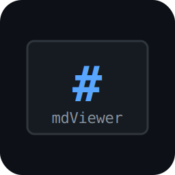

# MdPad

로컬 마크다운 노트를 위한 실시간 뷰어/편집기 데스크탑 앱 — 옵시디언 스타일 UI.



[](https://github.com/Hyeonseok0830/mdViewer/releases/latest)
[](LICENSE)

## 다운로드

[**최신 릴리즈**](https://github.com/Hyeonseok0830/mdViewer/releases/latest)에서 받을 수 있습니다.

| 플랫폼 | 파일 |
|---|---|
| Windows 설치형 | `MdPad.Setup.<버전>.exe` |
| Windows 포터블 | `MdPad.<버전>.exe` |
| Windows 스토어 | `MdPad.<버전>.appx` / `.msix` |
| macOS (Apple Silicon) | `MdPad-<버전>-arm64.dmg` |
| macOS (Intel) | `MdPad-<버전>.dmg` |
| Linux | `MdPad-<버전>.AppImage` / `mdpad_<버전>_amd64.deb` |

## 기능

### 노트 연결 (옵시디언 스타일)
- **위키링크** — `[[노트이름]]` 문법, 링크 자동완성, hover 미리보기 팝업, 볼트 어디에 있든 파일명으로 해석
- **노트 자동 생성** — 없는 노트의 `[[링크]]` 클릭 시 즉시 생성 후 열기 (미해결 링크는 흐리게 표시)
- **노트 임베드** — `![[노트이름]]`으로 다른 노트를 본문에 삽입
- **백링크** — 현재 노트를 참조하는 파일 목록을 사이드바에 표시
- **그래프 뷰** — 노트 간 연결을 인터랙티브 그래프로 시각화 (d3, 줌/드래그/클릭 이동)
- **태그** — `#태그` 자동 추출, 사이드바에서 태그별 필터링
- **데일리 노트** — 명령 팔레트에서 오늘 날짜(`YYYY-MM-DD.md`) 노트 생성/열기

### 렌더링
- **실시간 미리보기** — 파일 저장 즉시 자동 갱신 (WebSocket)
- **실시간 폴더 동기화** — 폴더에 파일이 추가/삭제되면 탐색기 자동 갱신 + 수동 ⟳ 버튼
- **구문 강조** — shiki 기반, 라이트/다크 이중 테마, 80여 개 언어
- **수식** — KaTeX (인라인 `$...$`, 블록 `$$...$$`)
- **다이어그램** — Mermaid (플로우차트, 시퀀스, 간트 등)
- **콜아웃** — `> [!note]`, `> [!warning]` 등 옵시디언 콜아웃 문법
- **GFM** — 표, 체크리스트(커스텀 체크박스 + 완료 취소선), 취소선
- **인라인 노트 제목** — 파일명을 노트 상단에 큰 제목으로 표시 (중복 헤딩 자동 감지)
- **헤딩 접기** — 헤딩 옆 토글로 섹션 접기/펼치기

### 탐색·편집
- **명령 팔레트** — `Ctrl+Shift+P`로 모든 동작 실행 (데일리 노트, 랜덤 노트, 모드 전환, 테마, 인쇄 등)
- **퀵 스위처** — `Ctrl+P`로 파일 이름 검색·이동
- **전체 검색** — `Ctrl+Shift+F`로 모든 노트 본문 검색 (스니펫 미리보기)
- **체크박스 클릭 반영** — 미리보기에서 체크박스를 클릭하면 `.md` 파일에 즉시 저장
- **파일 탐색기** — 트리 뷰, 들여쓰기 가이드, 즐겨찾기(★), 최근 파일, 이름변경/삭제 컨텍스트 메뉴
- **내장 편집기** — 미리보기/분할/편집 3모드, `Ctrl+S` 저장, 위키링크 자동완성,
  리스트·체크박스·인용 자동 이어쓰기(`Enter`), `Ctrl+B`/`Ctrl+I` 서식, `Ctrl+K` 링크, `Ctrl+Enter` 체크박스 토글
- **하위 폴더 노트 생성** — `폴더/하위/노트` 경로 입력 시 중간 폴더 자동 생성
- **탐색 히스토리** — `Alt+←` / `Alt+→` 뒤로/앞으로
- **목차(TOC)** — 헤딩 자동 추출, 현재 위치 하이라이트
- **6가지 테마** — 라이트 · 다크 · 모카 · 머테리얼 · 솔라라이즈드 · 노드
- **사이드바 리사이즈** — 드래그로 너비 조절, 더블클릭 초기화
- **Frontmatter** — YAML 파싱 및 카드 표시

## 단축키

| 키 | 동작 |
|---|---|
| `Ctrl+P` | 퀵 스위처 (파일 검색) |
| `Ctrl+Shift+P` | 명령 팔레트 |
| `Ctrl+Shift+F` | 전체 검색 |
| `Ctrl+S` | 저장 |
| `V` / `S` / `E` | 미리보기 / 분할 / 편집 모드 |
| `Ctrl+B` / `Ctrl+I` / `Ctrl+K` | 굵게 / 기울임 / 링크 (에디터) |
| `Ctrl+Enter` | 현재 줄 체크박스 토글 (에디터) |
| `Alt+←` / `Alt+→` | 뒤로 / 앞으로 |
| `Ctrl+O` | 파일 열기 |
| `Ctrl+Shift+O` | 폴더 열기 |
| `Esc` | 오버레이 닫기 |

## 시작하기

### 개발 환경 (CLI)

```bash
npm install
npm run dev -- sample/README.md        # 파일
npm run dev -- sample/                 # 폴더
```

### Electron 앱

```bash
npm run build
npm run electron:dev
```

### 배포용 빌드

`v*` 태그를 푸시하면 GitHub Actions가 Windows(NSIS/포터블/APPX), macOS(DMG x64+arm64), Linux(AppImage/deb)를 빌드해 릴리즈에 업로드합니다.
아티팩트 파일명은 `package.json`의 `version`을 따르므로 태그와 버전을 맞춰야 합니다.

```bash
# 로컬 Windows 빌드
npm run electron:build:nsis   # NSIS 인스톨러
npm run electron:build:appx   # Microsoft Store용 APPX
```

> **아이콘 생성**: Windows에서 `.\scripts\make-icon.ps1` 실행 (ImageMagick 필요)

## 아키텍처

5개의 에이전트가 중앙 EventBus를 통해 통신합니다.

```
FileAgent ──────┐
WatchAgent ─────┤──▶ EventBus ──▶ RenderAgent ──▶ ServerAgent ──▶ BrowserAgent
                │                                       │
                └───────────────────────────────────────┘
```

| 에이전트 | 역할 |
|---------|------|
| `FileAgent` | 파일/폴더 스캔 (대형 폴더는 경로만 우선 수집, 지연 로딩) |
| `WatchAgent` | chokidar 파일 감시 — 변경/추가/삭제 감지 |
| `RenderAgent` | unified 파이프라인 (remark→rehype→shiki/KaTeX/Mermaid), on-demand 렌더링 |
| `ServerAgent` | Fastify HTTP + WebSocket 서버, REST API, 검색 인덱스 |
| `BrowserAgent` | 클라이언트 JS (WS 수신, 트리/TOC/에디터/그래프 렌더링) |

자세한 설계는 [agents.md](agents.md)를 참고하세요.

## 기술 스택

| 분류 | 라이브러리 |
|------|-----------|
| 런타임 | Node.js 20+, TypeScript 5 |
| 데스크탑 | Electron 41 |
| HTTP/WS | Fastify 5, @fastify/websocket |
| 마크다운 | unified, remark-parse, remark-rehype, remark-gfm |
| 구문 강조 | shiki 4 |
| 수식 | KaTeX (rehype-katex) |
| 다이어그램 | Mermaid 11 |
| 그래프 뷰 | d3 |
| 파일 감시 | chokidar 3 |
| 패키징 | electron-builder |

## Microsoft Store 배포

[store/](store/) 폴더에 제출용 리소스가 준비되어 있습니다.

- [`store/description_ko.md`](store/description_ko.md) — 한국어 앱 설명
- [`store/description_en.md`](store/description_en.md) — 영어 앱 설명
- [`store/privacy_policy_ko.md`](store/privacy_policy_ko.md) — 개인정보 처리방침 (한국어)
- [`store/privacy_policy_en.md`](store/privacy_policy_en.md) — Privacy Policy (영어)
- [`store/store_assets.md`](store/store_assets.md) — Partner Center 제출 체크리스트

## 라이선스

[MIT](LICENSE)
