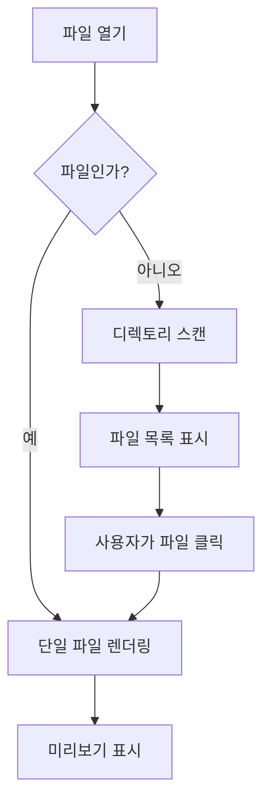
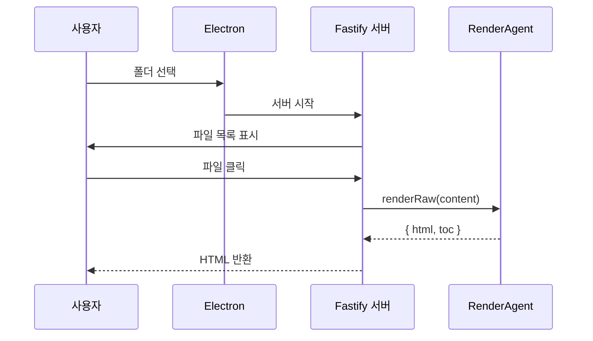
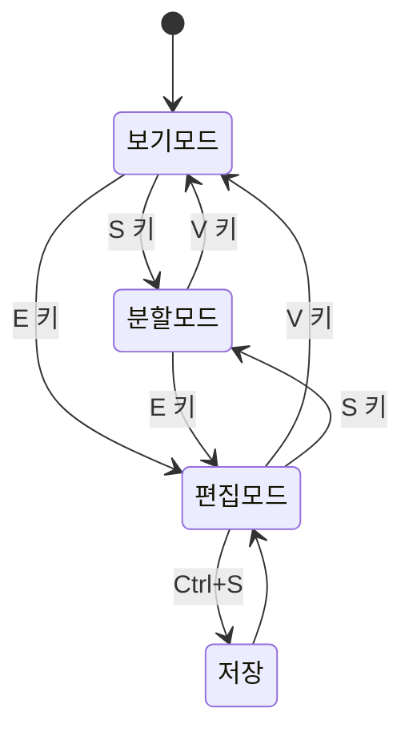
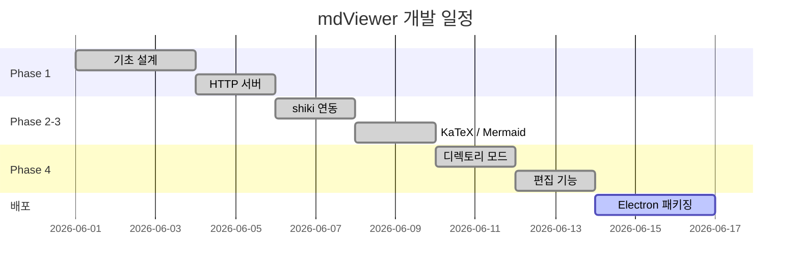

# 다이어그램 (Mermaid)

코드 블록에 `mermaid`를 지정하면 다이어그램으로 렌더링됩니다.

## 플로우차트

```mermaid
flowchart TD
    A[파일 열기] --> B{파일인가?}
    B -- 예 --> C[단일 파일 렌더링]
    B -- 아니오 --> D[디렉토리 스캔]
    D --> E[파일 목록 표시]
    E --> F[사용자가 파일 클릭]
    F --> C
    C --> G[미리보기 표시]
```

## 시퀀스 다이어그램

```mermaid
sequenceDiagram
    participant U as 사용자
    participant E as Electron
    participant S as Fastify 서버
    participant R as RenderAgent

    U->>E: 폴더 선택
    E->>S: 서버 시작
    S->>U: 파일 목록 표시
    U->>S: 파일 클릭
    S->>R: renderRaw(content)
    R-->>S: { html, toc }
    S-->>U: HTML 반환
```

## 상태 다이어그램

```mermaid
stateDiagram-v2
    [*] --> 보기모드
    보기모드 --> 분할모드 : S 키
    보기모드 --> 편집모드 : E 키
    분할모드 --> 보기모드 : V 키
    분할모드 --> 편집모드 : E 키
    편집모드 --> 보기모드 : V 키
    편집모드 --> 분할모드 : S 키
    편집모드 --> 저장 : Ctrl+S
    저장 --> 편집모드
```

## 간트 차트

```mermaid
gantt
    title mdViewer 개발 일정
    dateFormat  YYYY-MM-DD
    section Phase 1
    기초 설계        :done, 2026-06-01, 3d
    HTTP 서버        :done, 2026-06-04, 2d
    section Phase 2-3
    shiki 연동       :done, 2026-06-06, 2d
    KaTeX / Mermaid  :done, 2026-06-08, 2d
    section Phase 4
    디렉토리 모드    :done, 2026-06-10, 2d
    편집 기능        :done, 2026-06-12, 2d
    section 배포
    Electron 패키징  :active, 2026-06-14, 3d
```
