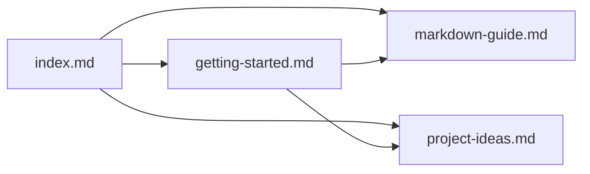

# 마크다운 문법 가이드

[[index|← 메인으로]] | [[getting-started|시작 가이드]]

> [!IMPORTANT]
> MdPad는 GitHub Flavored Markdown(GFM)을 완벽하게 지원합니다.

## 헤딩

```markdown
# H1 제목
## H2 제목
### H3 제목
#### H4 제목
```

## 강조

**굵게**, *기울임*, ~~취소선~~, `인라인 코드`

## 목록

- 항목 1
  - 중첩 항목
  - 또 다른 항목
- 항목 2

1. 번호 목록
2. 두 번째
3. 세 번째

## 링크와 Wiki Links

- 일반 링크: [GitHub](https://github.com)
- Wiki Link: [[project-ideas]] (다른 노트로 이동)
- [[getting-started|별칭 링크]] (텍스트를 다르게 표시)

## 코드 블록

```typescript
interface Note {
  title: string;
  content: string;
  tags: string[];
}

const note: Note = {
  title: 'MdPad 예제',
  content: '마크다운 내용',
  tags: ['#마크다운', '#예제'],
};
```

## 표

| 언어 | 하이라이팅 |
|------|-----------|
| TypeScript | ✅ |
| Python | ✅ |
| Rust | ✅ |
| Go | ✅ |

## 수학 (KaTeX)

인라인 수식: $E = mc^2$

블록 수식:

$$
\sum_{n=1}^{\infty} \frac{1}{n^2} = \frac{\pi^2}{6}
$$

## Callouts

> [!NOTE]
> 참고 사항입니다.

> [!WARNING]
> 주의가 필요합니다.

> [!TIP]
> 유용한 팁입니다.

> [!IMPORTANT]
> 중요한 내용입니다.

> [!CAUTION]
> 조심하세요!

## 다이어그램 (Mermaid)



#마크다운 #문법 #참고
